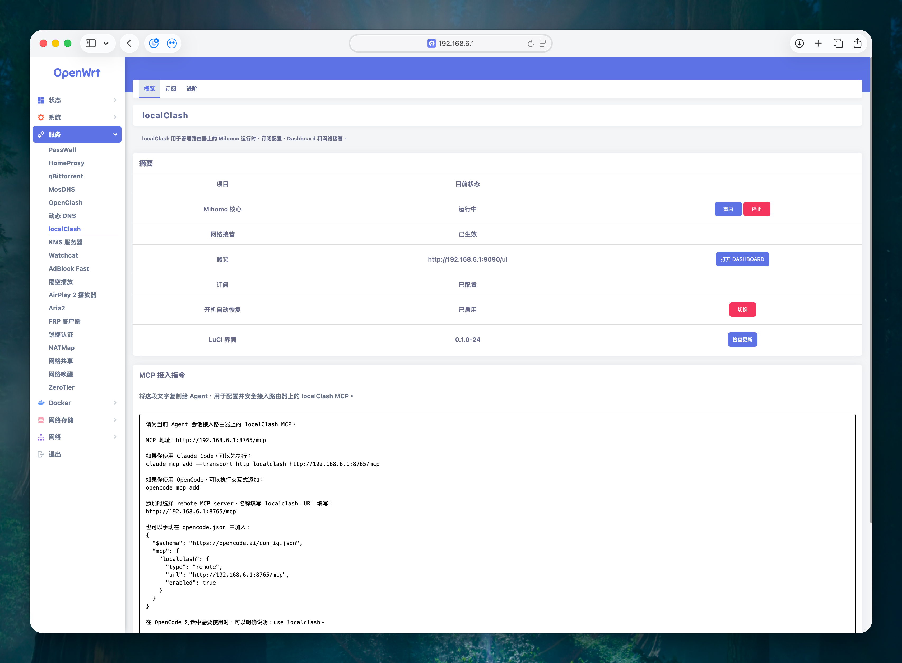
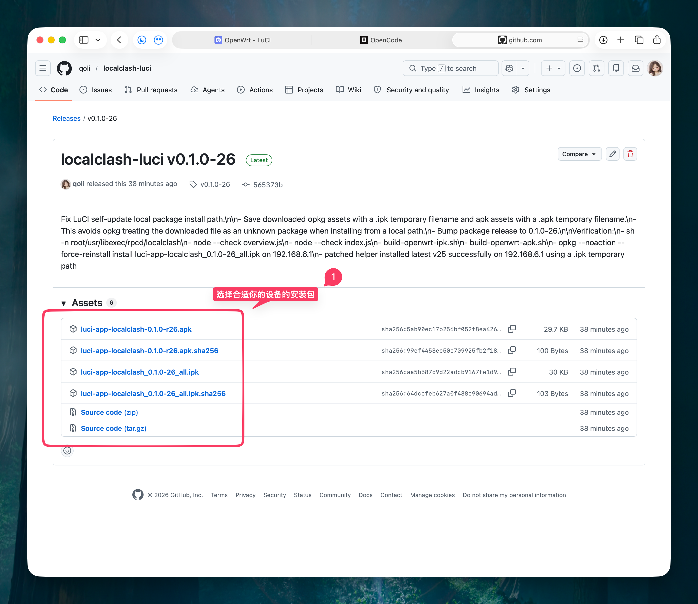
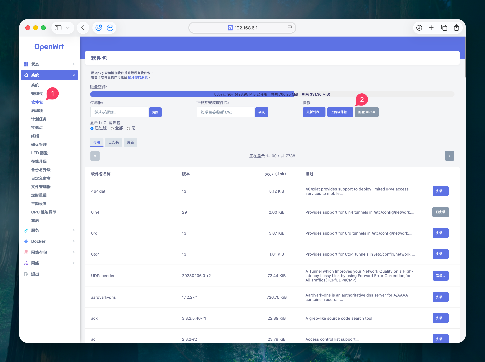
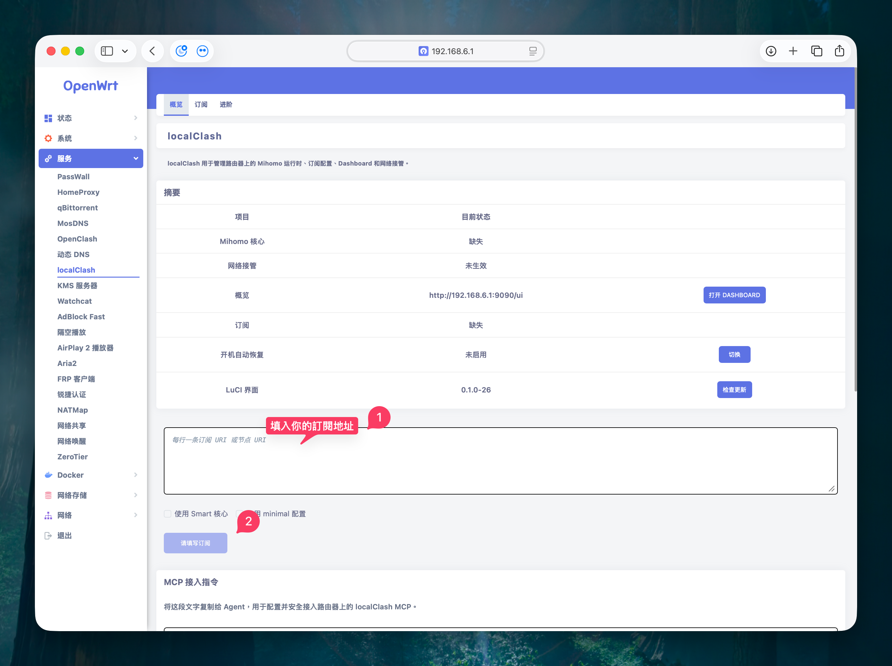

# localclash-luci

[](https://github.com/qoli/localclash-luci/releases/latest)
[](LICENSE)
[](https://openwrt.org/)
[](https://github.com/qoli/localClash)

`localclash-luci` 是 localClash 的 OpenWrt 后台页面。你不用写命令，也不用手动配置 Mihomo，只要在 OpenWrt 后台上传安装包、填入订阅地址，然后等待初始化完成。



> [!TIP]
> ☕ localClash 是独立维护的开源项目。如果它帮你省了配置 Mihomo 和接管路由器网络的时间，欢迎支持项目继续维护。
>
> [](https://github.com/qoli/localClash/blob/main/SUPPORT.md)
>
> [支持 localClash](https://github.com/qoli/localClash/blob/main/SUPPORT.md)

最简单的流程是：

```text
下载 LuCI 安装包 -> 上传到 OpenWrt -> 进入 服务 -> localClash
-> 填写订阅地址 -> 开始初始化 -> 看到“运行中”
```

## 适合谁

- 你有一台已经刷好 OpenWrt 的路由器。
- 你能打开 OpenWrt 后台，例如 `http://192.168.6.1` 或你自己的路由器地址。
- 你手上有一个订阅地址，或者有单独的节点 URI。
- 你想让 localClash 帮你管理 Mihomo、订阅、Dashboard 和路由器网络接管。

如果你还不知道“订阅地址”是什么，先向你的服务提供方确认。localClash 不提供订阅，也不提供节点。

## 第 1 步：下载安装包

打开最新发布页：

[https://github.com/qoli/localclash-luci/releases/latest](https://github.com/qoli/localclash-luci/releases/latest)

在页面下方找到 `Assets`，这里会列出可以下载的文件。



图里的红色 `1` 标出来的是下载区域。你只需要在这里选一个适合自己路由器的安装包。

只需要下载一个安装包：

| 你的路由器系统 | 下载哪个文件 |
| --- | --- |
| OpenWrt 24.10 或更旧，后台软件包页面使用 `opkg` | 下载文件名以 `_all.ipk` 结尾的文件 |
| OpenWrt 25.12 或更新，后台软件包页面使用 `apk` | 下载文件名以 `.apk` 结尾的文件 |

大多数用户应该下载 `.ipk`。如果你不确定，就先看 OpenWrt 后台的软件包页面：页面上写着 `opkg` 就选 `.ipk`，写着 `apk` 就选 `.apk`。

不要下载这些文件：

- `.sha256`：这是校验文件，不是安装包。
- `Source code (zip)` / `Source code (tar.gz)`：这是源码，不是给路由器后台上传的安装包。

## 第 2 步：上传到 OpenWrt

打开 OpenWrt 后台，进入：

```text
系统 -> 软件包
```



图里的红色 `1` 是左侧的 `软件包` 菜单。红色 `2` 附近是操作按钮区域，普通安装本地包时，点击旁边的 `上传软件包...` 即可，不需要修改 OPKG 配置。

按顺序操作：

1. 左侧菜单点 `系统`。
2. 点 `软件包`。
3. 点页面里的 `上传软件包...`。
4. 选择刚才下载的 `.ipk` 或 `.apk` 文件。
5. 上传后确认安装。
6. 安装完成后，刷新浏览器页面。

如果左侧菜单没有出现 `localClash`，先退出 OpenWrt 后台再重新登录。还是没有的话，重启一次路由器。

## 第 3 步：进入 localClash

安装完成后，在左侧菜单进入：

```text
服务 -> localClash
```

第一次进入时，通常会看到 Mihomo 核心缺失、订阅缺失、网络接管未生效。这是正常的，因为你还没有初始化。

## 第 4 步：填写订阅并初始化

在 `服务 -> localClash` 页面中，找到订阅输入框。



图里的红色 `1` 是订阅输入框。红色 `2` 是初始化按钮所在的位置。

按顺序操作：

1. 把你的订阅地址粘贴进去。
2. 如果有多个订阅或节点，每行放一个地址。
3. 一般用户可以先不勾选 `使用 Smart 核心` 和 `使用 minimal 配置`。
4. 点击 `开始初始化`。
5. 等待任务完成，不要中途刷新页面或断电。

初始化会自动做这些事：

- 下载或更新 localClash 核心。
- 下载 Mihomo 核心和 Dashboard。
- 保存并刷新订阅。
- 生成 Mihomo 配置。
- 启动运行时。
- 接管路由器网络。

这一步会影响整台路由器的上网。如果这台路由器正在依赖 OpenClash、PassWall 或其他插件维持网络，先确认你知道怎么切回原来的插件，再点 `开始初始化`。

## 第 5 步：确认已经成功

初始化完成后，回到 `概览` 页。看到下面这些状态，说明已经跑起来了：

- `Mihomo 核心` 显示 `运行中`。
- `网络接管` 显示 `已生效`。
- `订阅` 显示 `已配置`。
- 页面上有 `打开 Dashboard` 按钮。


点击 `打开 Dashboard` 可以进入 Mihomo Dashboard，查看节点、连接和规则命中情况。

## 以后怎么更新

localClash 现在提供 `一键更新`：更新 LuCI 界面、localClash 核心、Mihomo 核心和 Dashboard，并自动刷新已保存订阅、重建配置，最后恢复运行时和网络接管。

日常更新时，先进入：

```text
服务 -> localClash
```

在 `概览` 页点击 `一键更新`。更新准备阶段会尽量保持当前运行时继续工作；只有最后切换 Mihomo 运行时并恢复接管时，可能会短暂断网。

`同步最新默认策略（推荐）` 默认勾选，会重建 localClash 内置默认策略并保留用户自定义策略；手动改过的默认策略会被新版默认值覆盖。取消勾选后，LuCI 会把选择保存到路由器的 localClash 工作目录，下次打开页面和执行一键更新时会沿用上次选择。

如果订阅源临时不可用，`一键更新` 会使用已保存的订阅缓存继续完成配置生成和验证；缓存不可用或配置验证失败时仍会停止，不会继续切换运行时。

如果要单独维护某个组件，可以使用 `高级组件维护`：

- 点 `安装 / 更新核心`：安装或刷新 localClash 核心和基础文件。
- 点 `更新 localClash`：更新 localClash 运行时程序。
- 点 `更新 Mihomo`：更新 Mihomo 核心。
- 点 `更新 Dashboard`：更新 Dashboard 面板文件。

如果只是更新这些组件，通常不需要重新下载 `.ipk` 或 `.apk`。只有页面里的 `检查更新` 不可用，或者你需要手动安装指定版本时，才回到 GitHub Release 重新下载 LuCI 安装包。

重新初始化主要用于重新应用默认配置、刷新订阅并重新启动运行时。只是普通更新时，不需要反复点击 `开始初始化`。

## 常见问题

### 安装后看不到菜单

先刷新浏览器页面。如果还看不到，退出 OpenWrt 后台并重新登录。仍然没有的话，重启路由器。

### 点初始化前要不要先关掉 OpenClash 或 PassWall

建议先关闭 OpenClash、PassWall 或其他会接管路由器网络的代理插件，再开始 localClash 初始化。这样可以避免多个插件同时修改防火墙、DNS 或透明代理规则，确保 localClash 能正常接管网络。

### 订阅地址填在哪里

填在 `服务 -> localClash` 页面里的大输入框中。每行一个订阅 URI 或节点 URI。

### `.sha256` 要不要下载

不要。普通用户只需要下载 `.ipk` 或 `.apk` 安装包。

更多问题见 [常见问题](docs/faq.md)。

## 支持 localClash

如果 localClash 帮你省了配置 Mihomo 和接管路由器网络的时间，可以请作者喝杯咖啡，支持项目继续维护：

[](https://github.com/qoli/localClash/blob/main/SUPPORT.md)

[支持 localClash](https://github.com/qoli/localClash/blob/main/SUPPORT.md)

## 更多文档

- 产品边界：[docs/openwrt-luci.md](docs/openwrt-luci.md)
- ucode 改写提案：[docs/ucode-rewrite-adaptation.md](docs/ucode-rewrite-adaptation.md)
- 真机测试：[docs/real-router-safe-test.md](docs/real-router-safe-test.md)
- 发布流程：[docs/github-release-runbook.md](docs/github-release-runbook.md)

## 许可证

MIT License。见 [LICENSE](LICENSE)。
