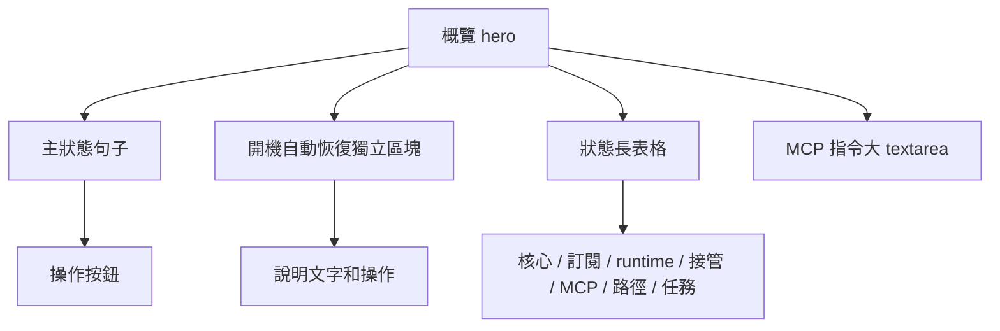
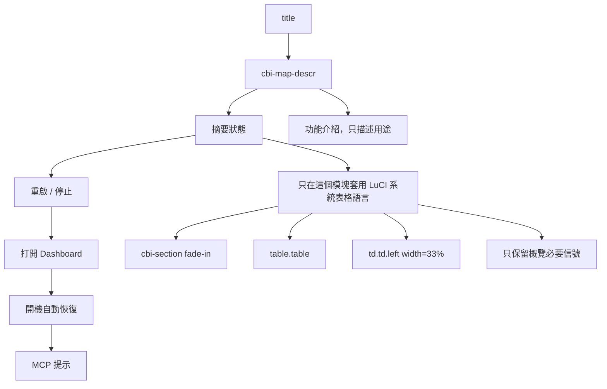
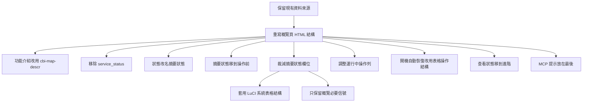

# localClash LuCI 概覽頁重設計討論稿

狀態：概念溝通稿

日期：2026-06-02

目標：先重設計 `服務 -> localClash -> 概覽` 裡的功能介紹和狀態呈現。功能介紹用 LuCI 原生 `cbi-map-descr`；複合狀態用第一個信息模塊「摘要狀態」承載，並接近 OpenWrt LuCI 原生 `狀態 -> 概覽 -> 系統` 的 HTML 佈局語言。

## 核心方向

這次先不討論具體 JS 實作，也不先列完整欄位。

討論重點分成兩層：

```text
功能介紹：使用 LuCI cbi-map-descr 做統一化描述。
摘要狀態：使用 LuCI「狀態 -> 概覽 -> 系統」的 HTML 佈局結構。
```

也就是：

- 頁面標題下方的介紹文字放在 `cbi-map-descr`
- 使用 LuCI 原生 `cbi-section fade-in`
- 使用 LuCI 原生 `table.table`
- 左欄是固定寬度的狀態名稱
- 右欄是簡短狀態值
- `系統` 表格規則只影響「摘要狀態」模塊
- 不再使用單行 `service_status` 壓縮 localClash 的複合狀態

## 參考語言

### 功能介紹

LuCI 工具頁會在 `cbi-map` 標題下方用 `cbi-map-descr` 做功能介紹，例如：

```html
<div id="cbi-vlmcsd" class="cbi-map">
  <h2 name="content">KMS 服务器</h2>
  <div class="cbi-map-descr">KMS服务器可用于激活 Windows 或 Office。</div>
  ...
</div>
```

localClash 概覽頁也應該使用同一種位置和語言：

```text
localClash 用於管理路由器上的 Mihomo 運行時、訂閱配置、Dashboard 和網路接管。
```

這段文字只負責說明功能，不負責呈現當前狀態，也不放操作按鈕。

### 摘要狀態

OpenWrt 原生 `系統` 區塊大致長這樣：

```text
┌──────────────────────────────────────────────┐
│ 系統                                         │
├──────────────────────┬───────────────────────┤
│ 主機名               │ OpenWrt                │
│ 型號                 │ FriendlyElec NanoPi R5C│
│ 架構                 │ ARMv8 ...              │
│ 固件版本             │ OpenWrt 24.10 ...      │
│ 本地時間             │ 2026-06-02 ...         │
│ 運行時間             │ 3d 1h ...              │
└──────────────────────┴───────────────────────┘
```

localClash 的摘要狀態應該借用這種語言，但只保留概覽必要信號：

```text
┌──────────────────────────────────────────────┐
│ 摘要狀態                                      │
├──────────────────────┬───────────────────────┤
│ Mihomo 核心           │ 運行中                 │
│ 網路接管             │ 生效中                 │
│ 訂閱                 │ 已配置                 │
└──────────────────────┴───────────────────────┘
```

重點不是整頁改成系統頁，而是讓「摘要狀態」這個模塊像系統狀態一樣被讀懂。它不是進階頁的完整狀態表，不能把路徑、MCP 端點、模板細節、任務 JSON 這類原始診斷全部暴露在概覽頁。

其中運行中狀態的強調區操作能力至少應包含：

```text
[打開 Dashboard] [重啟運行時] [停止運行時]
```

`重啟運行時` 是運行中狀態下的常用恢復能力，不應只留在進階頁。

`查看狀態` 不放在概覽頁。概覽頁本身已經呈現整理後的狀態，再提供一個 raw status 拉取按鈕會讓新手困惑，也會增加理解成本。這個能力應移到 `進階` 頁。

### 開機自動恢復

開機自動恢復區塊參考 LuCI 的表格操作結構：

```html
<div class="cbi-section cbi-tblsection">
  <h3>開機自動恢復</h3>
  <table class="table cbi-section-table">
    <tr class="tr table-titles">
      <th class="th">目前狀態</th>
      <th class="th cbi-section-actions"></th>
    </tr>
    <tr class="tr cbi-rowstyle-1">
      <td class="td" data-title="目前狀態">已啟用</td>
      <td class="td cbi-section-actions">
        <button class="btn cbi-button">切換</button>
      </td>
    </tr>
  </table>
</div>
```

抽象結構：

```text
┌──────────────────────────────────────────────┐
│ 開機自動恢復                                  │
├──────────────────────────────┬───────────────┤
│ 目前狀態                     │               │
├──────────────────────────────┼───────────────┤
│ 已啟用                       │ [切換]        │
└──────────────────────────────┴───────────────┘
```

這個區塊不使用大段說明文字。它只表達目前狀態和切換操作。

## 現在的問題

目前概覽頁的資訊層級接近這樣：



問題：

- 狀態表格太長，把「普通使用者要看的狀態」和「進階排障資訊」混在一起。
- 當前狀態信息暴露太多，基本接近 `進階` 頁的完整狀態。
- 狀態模塊位置太低，使用者要先看到操作，才看到狀態。
- 狀態模塊沒有明確借用 LuCI 原生 `系統` 區塊的 HTML 結構。
- 運行中狀態的操作能力缺少 `重啟運行時`。
- 單行 `service_status` 很難準確表達 localClash 的複合狀態。
- 功能介紹、操作按鈕、Dashboard、開機自動恢復、狀態表格、MCP 提示的順序需要明確。

## 目標結構

目標不是重做後端或 RPC，而是先把概覽頁的前端區塊順序和 LuCI 原生語言定清楚。



抽象成畫面：

```text
[title]

[cbi-map-descr]
localClash 用於管理路由器上的 Mihomo 運行時、訂閱配置、Dashboard 和網路接管。

┌──────────────────────────────────────────────┐
│ 摘要狀態                                      │  使用 LuCI「系統」表格結構
├──────────────────────┬───────────────────────┤
│ Mihomo 核心           │ 運行中                 │
│ 網路接管             │ 生效中                 │
│ 訂閱                 │ 已配置                 │
└──────────────────────┴───────────────────────┘

┌──────────────────────────────────────────────┐
│ [重啟運行時] [停止運行時]                     │
└──────────────────────────────────────────────┘

┌──────────────────────────────────────────────┐
│ [打開 Dashboard]                             │
└──────────────────────────────────────────────┘

┌──────────────────────────────────────────────┐
│ 開機自動恢復                                  │
├──────────────────────────────┬───────────────┤
│ 目前狀態                     │               │
├──────────────────────────────┼───────────────┤
│ 已啟用                       │ [切換]        │
└──────────────────────────────────────────────┘

┌──────────────────────────────────────────────┐
│ MCP 提示                                      │
└──────────────────────────────────────────────┘
```

## 溝通策略

這份設計先用抽象畫圖溝通，不直接爭論每個欄位。

討論順序：


先不要問：

- 每個 status JSON 欄位要怎麼映射？
- 每個按鈕具體放哪一行？
- 後端 API 要不要調整？

先問：

- 功能介紹是否應統一放在 `cbi-map-descr`？
- 功能介紹應該只說產品用途，還是也提示接管風險？
- 摘要狀態是否固定放在操作按鈕之前？
- 摘要狀態是否只保留 `Mihomo 核心 / 網路接管 / 訂閱` 三個概覽信號？
- 操作按鈕是否按 `重啟 / 停止` 和 `打開 Dashboard` 分成兩行？
- `開機自動恢復` 是否固定放在 Dashboard 後、MCP 提示前？
- 摘要狀態是否應該像 OpenWrt 原生 `系統` 模塊？
- 這個表格內應該保留哪些概念？
- 哪些內容應該從摘要狀態移出去？
- 哪些內容雖然保留在表格，但應該簡化顯示？
- 運行中狀態下的主操作是否應包含 `重啟運行時`？

## 初步決策

目前建議先定下來：

1. 功能介紹使用 LuCI 原生 `cbi-map-descr`。
2. 移除 `service_status`，不再嘗試用單行表達 localClash 的複合狀態。
3. 將原本的 `狀態` 模塊重命名為 `摘要狀態`。
4. `摘要狀態` 移到操作按鈕之前，作為第一個信息模塊。
5. `摘要狀態` 裁減為概覽信號，不複製 `進階` 頁完整狀態。
6. 運行中的普通操作列是 `[重啟運行時] [停止運行時]`。
7. `打開 Dashboard` 獨立成下一行操作。
8. `開機自動恢復` 固定放在 Dashboard 後、MCP 提示前，使用 `cbi-tblsection` / `cbi-section-table` 的表格操作結構。
9. `系統` 的 HTML 佈局結構只影響「摘要狀態」模塊。
10. 摘要狀態應該優先使用 LuCI 原生 table 結構。
11. `查看狀態` 屬於 raw 信息拉取，移到 `進階` 頁。
12. `進階` 頁可以保留更多原始診斷和操作。

## 待討論問題

1. 摘要狀態是否只保留 `Mihomo 核心 / 網路接管 / 訂閱` 三行？
2. 摘要狀態不顯示 `開機自動恢復`，是否完全交給獨立表格區塊？
3. 摘要狀態最多保留幾行才不會太重？
4. 路徑、端點、模板、任務這類值是否全部移到 `進階`？
5. `開機自動恢復` 區塊是否固定採用 `目前狀態 / 空白`、`已啟用 / 切換` 的兩欄表格？
6. `打開 Dashboard` 是否應該獨立一行，還是可與其他操作同列？
7. `cbi-map-descr` 的介紹文字是否需要包含「網路接管可能影響整台路由器」這類風險提示？

## 第一個實作切片

如果方向確認，第一刀只改狀態呈現的 HTML 結構，不改 RPC。



這樣可以先驗證狀態呈現的視覺語言，不把問題擴大成整頁重設計或後端 API 重設計。
