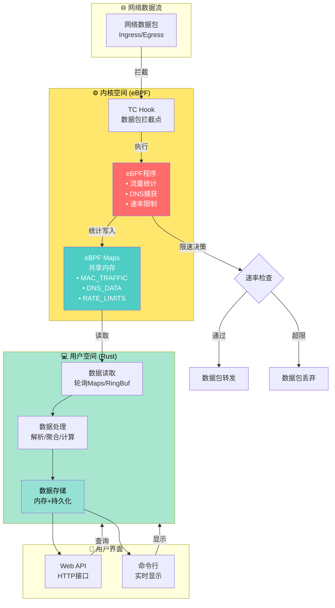
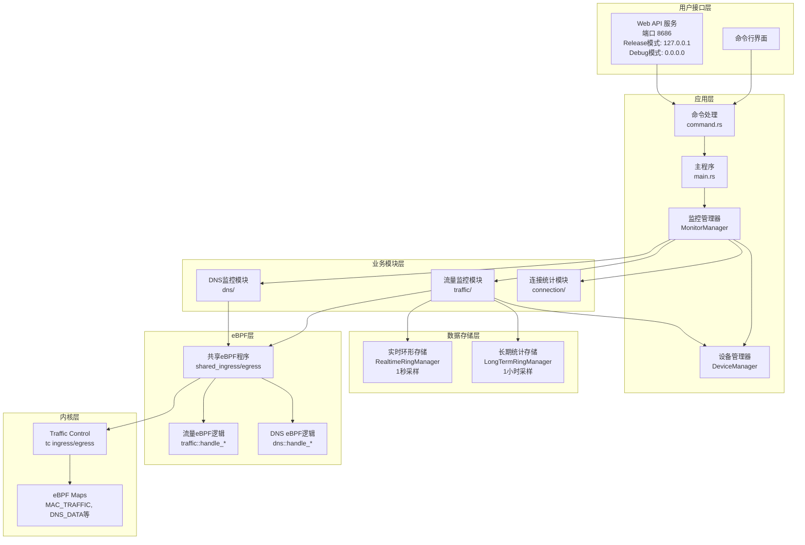
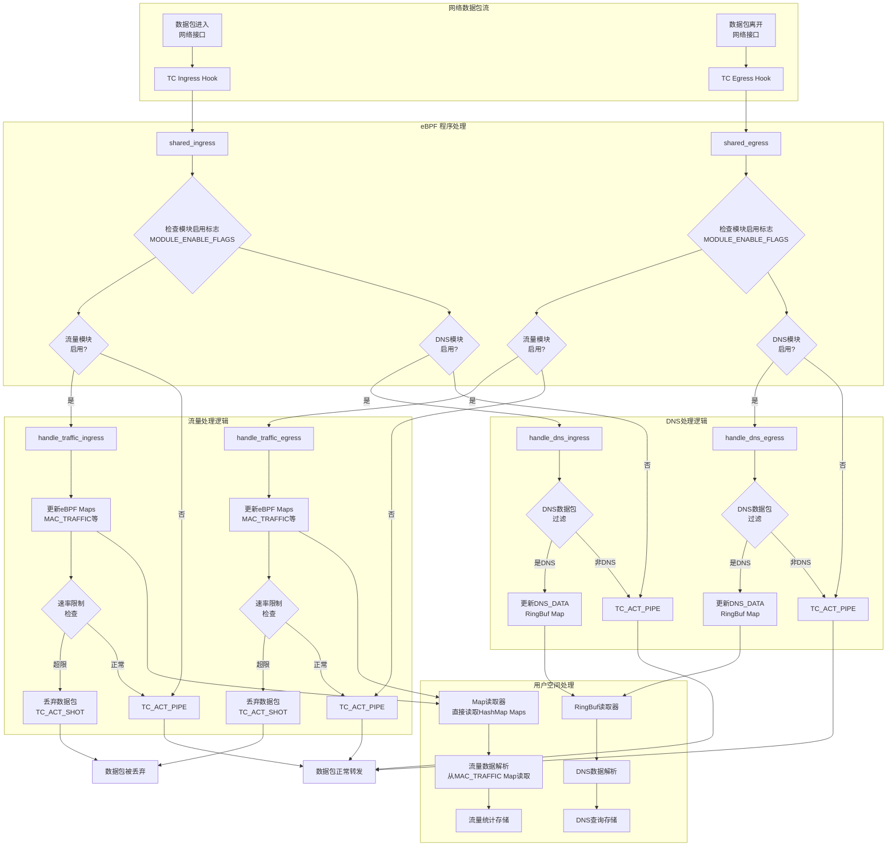
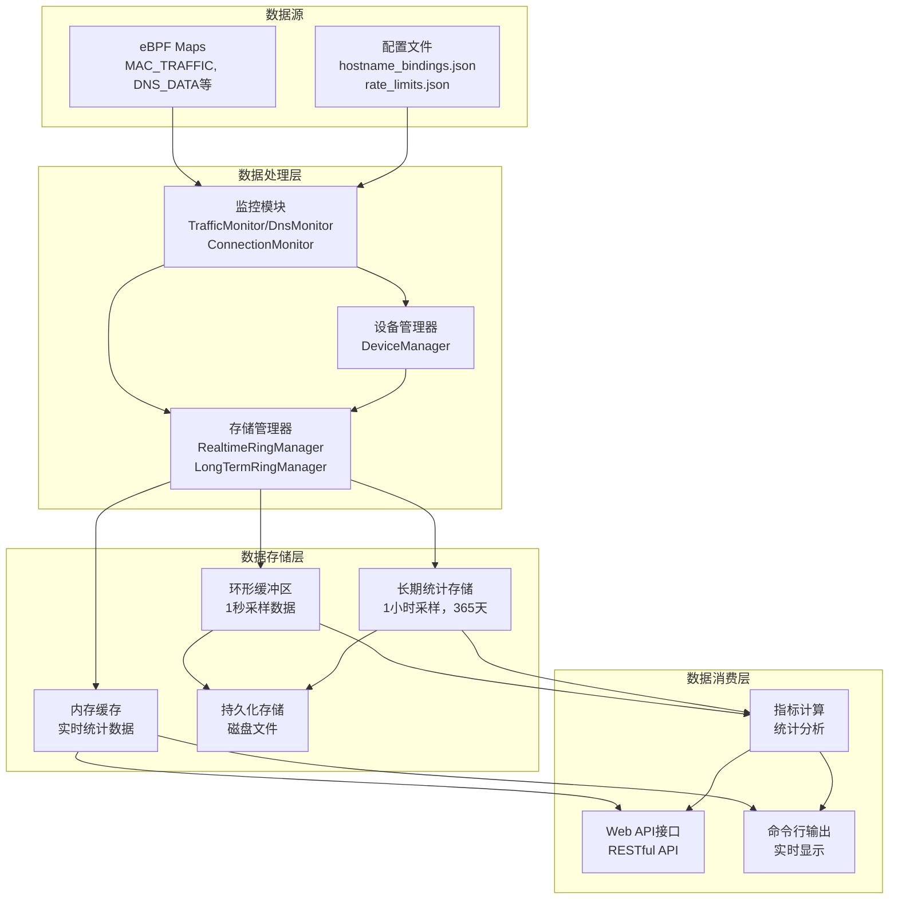
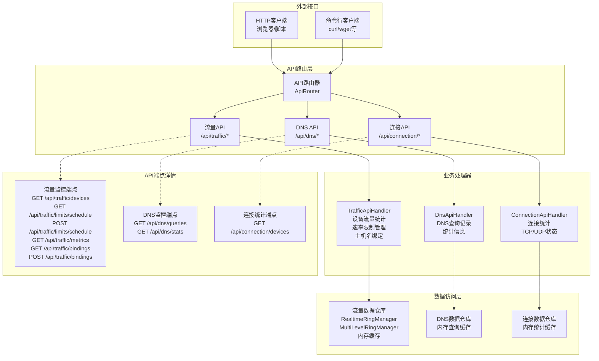
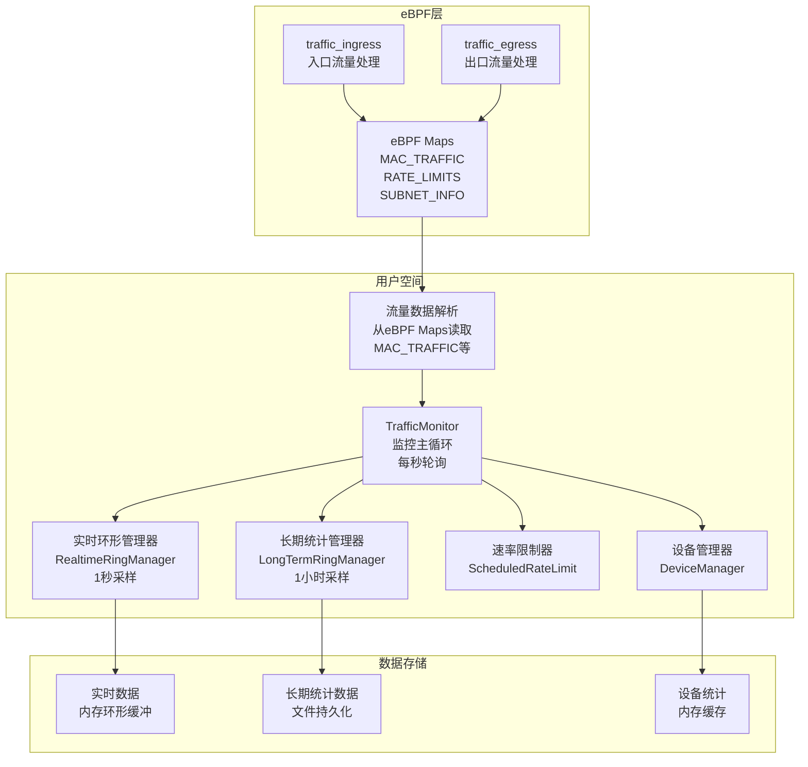
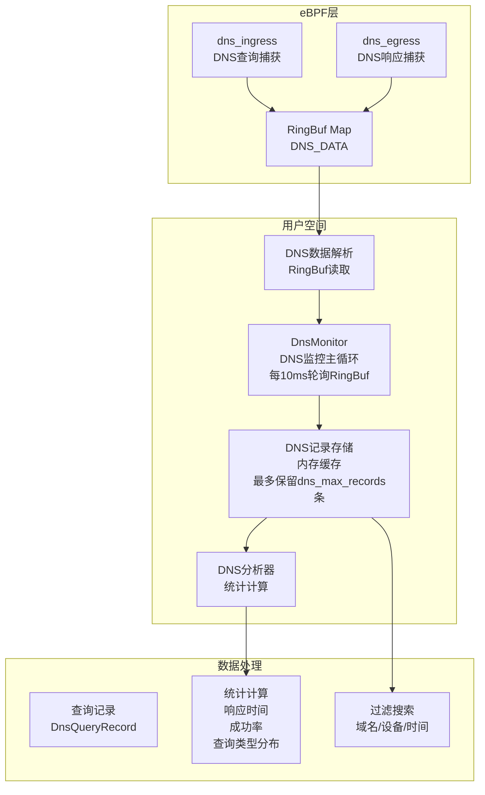
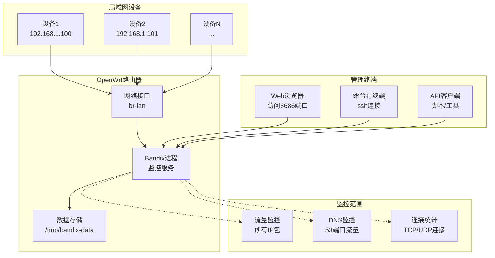

# Bandix 项目架构分析

## 项目概述

Bandix 是一个基于 eBPF 技术的网络流量监控工具，使用 Rust 语言开发。它采用模块化架构设计，能够实时监控局域网内设备的网络流量、连接状态和 DNS 查询，并提供 Web API 和命令行界面进行数据访问。

## 主要特性

- **基于 eBPF 技术**：高效监控网络流量，无需修改内核代码
- **模块化架构**：支持独立的流量监控、连接统计和 DNS 监控模块，可按需启用
- **统一设备管理**：集中的设备发现、状态跟踪和信息管理
- **双模式界面**：支持终端和 Web 接口显示
- **实时流量统计**：显示各设备的上传/下载速率和总流量
- **分层数据存储**：实时数据（1秒采样）和长期统计（1小时采样，365天保留）
- **连接统计**：按设备监控 TCP/UDP 连接及状态跟踪
- **MAC-IP关联**：自动关联 IP 地址与 MAC 地址
- **定时速率限制**：为设备设置基于时间的速率限制
- **主机名绑定**：自定义设备主机名映射
- **高性能**：使用 Rust 和 eBPF 确保监控对系统性能影响最小

## 技术原理

### 核心工作原理图

### 工作原理说明

**数据捕获**：网络数据包被 TC Hook 拦截，eBPF 程序在内核中直接处理数据包，执行统计、过滤、速率限制等操作。

**数据传递**：eBPF Maps 和 RingBuf 作为内核与用户空间的共享内存，实现高效数据传递。

**数据处理**：用户空间程序定期轮询读取统计数据，进行解析、聚合和速率计算。

**数据展示**：通过 Web API 和命令行界面提供实时监控和历史数据查询。

**核心优势**：零拷贝、高性能、低开销、安全可靠的 eBPF 技术实现。

## 项目架构

### 详细架构图

### 核心组件说明

#### 1. 主程序 (main.rs)
- 程序入口点
- 解析命令行参数
- 初始化异步运行时 (tokio)

#### 2. 命令处理 (command.rs)
- 参数验证和解析
- 模块上下文创建
- 共享资源初始化（主机名绑定、eBPF程序、设备管理器）
- 服务启动和关闭处理

#### 3. 设备管理器 (DeviceManager)
- 统一管理局域网设备发现和状态跟踪
- 维护设备信息（MAC、IP、主机名、在线状态）
- 定期刷新邻居表和设备状态
- 提供设备流量统计和状态查询接口

#### 4. 监控管理器 (MonitorManager)
- 统一管理所有监控模块
- 模块生命周期管理（初始化、启动、停止）
- API 路由注册和模块协调

#### 5. 业务模块
- **流量监控模块**：处理网络流量统计、速率限制、数据存储
- **DNS监控模块**：捕获和分析 DNS 查询/响应
- **连接统计模块**：统计 TCP/UDP 连接状态

### eBPF 数据流图

### 数据流架构图

### Web API 架构图

## 模块详细设计

### 1. 流量监控模块 (traffic/)

#### 架构图

#### 核心功能
- **实时流量统计**：监控每个设备的上传/下载字节数和速率
- **速率限制**：基于时间调度的流量限制，支持白名单机制
- **分层数据存储**：1秒实时数据 + 1小时长期统计（365天保留）
- **MAC-IP关联**：通过设备管理器自动关联MAC地址和IP地址
- **设备状态跟踪**：监控设备在线/离线状态和最后活动时间

### 2. DNS监控模块 (dns/)

#### 架构图

#### 核心功能
- **DNS查询捕获**：捕获所有DNS查询和响应
- **响应时间分析**：计算DNS查询响应时间
- **统计分析**：查询成功率、查询类型分布、最活跃设备等
- **记录过滤**：支持按域名、设备、时间等条件过滤

### 3. 连接统计模块 (connection/)

#### 核心功能
- **TCP连接状态跟踪**：通过读取 `/proc/net/nf_conntrack` 文件统计不同状态的TCP连接数
- **UDP连接统计**：统计UDP连接数量
- **设备关联**：结合ARP表将连接统计与MAC/IP地址关联
- **全局统计**：提供网络范围的连接统计信息（每3秒更新一次）

## 部署架构

