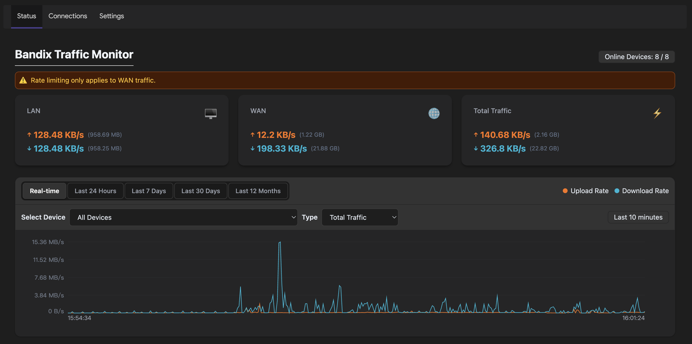
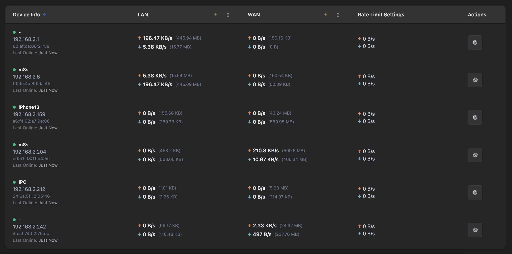

# LuCI Bandix

English | [简体中文](README.zh.md) | [架构文档](ARCHITECTURE.md)

[](LICENSE)


LuCI Bandix is a network traffic monitoring application for OpenWrt, providing intuitive traffic data visualization and analysis through the LuCI web interface.

## Introduction

LuCI Bandix is developed based on the LuCI framework, offering network traffic monitoring capabilities for OpenWrt routers. This application depends on the openwrt-bandix backend service and helps users view and analyze network traffic statistics in real-time.

**Note**: This application is primarily designed for home users and simple network environments. It is not recommended for complex network architectures (such as VLAN) or enterprise-level deployments.

**Important**: Hardware flow offloading must be disabled for accurate traffic monitoring. Please disable hardware flow offloading in OpenWrt before using this application.

## Installation


1. First install the openwrt-bandix backend

   Download the appropriate package for your device from [openwrt-bandix Releases](https://github.com/timsaya/openwrt-bandix/releases), then install:

   ```bash
   opkg install bandix_latest_architecture.ipk  # (or apk add --allow-untrusted bandix_latest_architecture.apk)
   ```

2. Install the luci-app-bandix frontend

   Download the package from [luci-app-bandix Releases](https://github.com/timsaya/luci-app-bandix/releases), then install:

   ```bash
   opkg install luci-app-bandix_latest_all.ipk  # (or apk add --allow-untrusted luci-app-bandix_latest_all.apk)
   ```

3. Configure your LAN interface in settings

   After installation, you can access the Bandix application through the LuCI web interface under the "Network" menu. Go to the Bandix settings page and select your LAN interface to enable proper monitoring. Make sure to check the "Enable" option to start the service.


## Screenshots






## Features

- Real-time network traffic monitoring
- Intuitive data visualization interface
- Seamless integration with OpenWrt system
- Automatically obtain the host name from DHCP/DNS (Static Leases)
- High-performance implementation based on Rust eBPF
- Support for LAN/WAN speed monitoring
- Support device TCP/UDP connection number monitoring
- Support for WAN speed limitation
- Support IPv4/IPv6
- Persistent data storage
- Support real-time/daily/weekly/monthly monitoring
- Historical traffic trends and charts
- Support DNS query monitoring and statistical analysis


## System Requirements

- **Linux Kernel**: Linux 6.x and above
- **OpenWrt Version**: Recommended OpenWrt 24.10 and above


## Third-party Dependencies

luci-app-bandix requires the following dependency packages:

- **curl**: HTTP client library for network requests
- **luci-lib-jsonc**: JSON parsing library for data processing
- **jsonfilter**: JSON query tool for filtering and extracting data
- **jshn**: JSON shell library for shell script JSON operations

These dependencies will be automatically installed when installing luci-app-bandix, but some firmware may require manual installation of these dependency packages.


## Version Dependencies

The following table shows the version dependency relationship between luci-app-bandix and openwrt-bandix:

| luci-app-bandix version | Required openwrt-bandix version |
|------------------------|--------------------------------|
| 0.6.x                  | 0.6.x                          |
| 0.7.x                  | 0.7.x                          |
| 0.8.x                  | 0.8.x                          |
| 0.9.x                  | 0.9.x                          |
| 0.10.x                 | 0.10.x                         |


Please ensure you install matching versions to ensure compatibility and proper functionality.


## License

This project is licensed under the [Apache 2.0 License](LICENSE).
