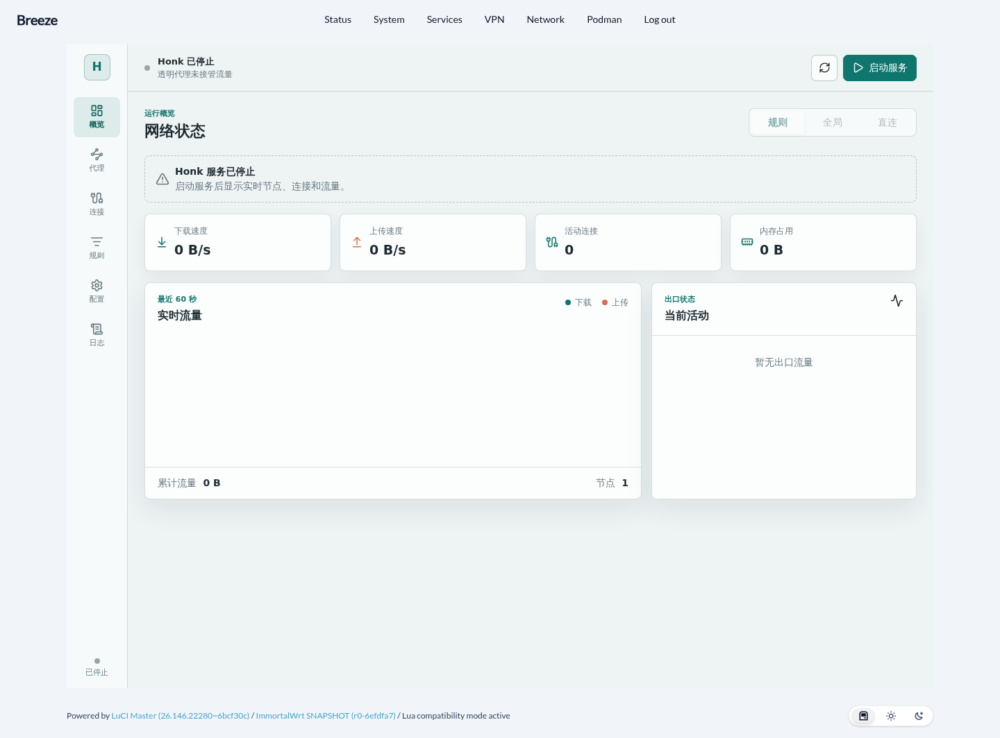

# Honk OpenWrt Feed

[English](README.md) | 简体中文

本仓库将 [Honk](https://github.com/Glassyiris/honk) Rust/eBPF 透明代理引擎打包为 OpenWrt 软件包，并提供原生 LuCI 管理界面。

包含两个软件包：

- honk：honk-core、honk-tool、procd 服务、默认配置、eBPF 资源和运行日志。
- luci-app-honk：认证控制器、RPC 桥接、配置编辑器、节点与订阅管理、运行概览、流量统计和日志页面。

上游源码固定在提交 63e271065246bb68ecadf9ae53abecf748806ad3（v0.0.1.beta.25），当前支持 OpenWrt x86_64 和 aarch64。

## 界面展示

管理界面是原生 LuCI 单页应用，不会下载或嵌入第二套外部面板。

| 概览 | 配置 |
| --- | --- |
|  |  |

移动端会自动切换为窄屏布局：

## 功能

- 由 OpenWrt procd 管理的 Rust/eBPF 透明代理运行时。
- 按顺序匹配 routing 规则，支持直连、代理、阻断、节点组和 direct(must)。
- 通过 Clash 兼容 API 提供规则、全局、直连三种运行模式。
- 节点导入、编辑、删除、连接测试、订阅和选择器分组。
- 支持 UDP、TCP、TCP+UDP、TLS、HTTPS、H3、QUIC DNS 上游。
- 独立的 DNS 请求路由和响应路由配置。
- 实时流量、连接、内存、节点、规则和服务状态。
- Honk 日志写入 /tmp/honk/honk.log，不转发到 logread。
- 保存/应用流程包含配置校验、版本检查、原子替换和重启回滚。

## 目录结构

~~~text
honk/                  Honk 引擎和服务的 OpenWrt 配方
luci-app-honk/         LuCI 软件包、RPC 桥接和前端源码
honk/patches/          OpenWrt 专用上游补丁
locks/source.lock.json 源码和补丁摘要锁定文件
tests/                 打包和集成检查
~~~

## 构建要求

快速打包流程支持 x86_64 和 aarch64。SDK 阶段只需要 OpenWrt SDK，以及提供 v2ray-geoip、v2ray-geosite、kmod-sched-core、kmod-sched-bpf、kmod-veth 的 feeds；该阶段不再安装 Rust。

独立的二进制构建在标准 Linux 环境中运行，需要 Rust stable、带 rust-src 的 Rust nightly、bpf-linker、LLVM/libclang、CMake 和 Zig 0.14.1。它会生成静态 musl 程序，并嵌入带 BTF 的 eBPF 对象。`honk/files/bin/` 中没有成品时，软件包配方仍保留原来的源码构建路径，此时需要 OpenWrt Rust 工具链。

## 构建

快速打包前先下载并校验对应架构的静态成品。GitHub Actions 会自动执行；本地可以运行：

~~~sh
PACKAGE_ARCH=x86_64 .github/scripts/download-honk-binaries.sh
PACKAGE_ARCH=aarch64 .github/scripts/download-honk-binaries.sh
~~~

然后将本仓库作为 feed 安装，或把软件包目录放入 buildroot，刷新 feed 并在 menuconfig 中选择两个软件包：

~~~sh
./scripts/feeds update honk
./scripts/feeds install -a -p honk
make menuconfig
make package/honk/compile V=s
make package/luci-app-honk/compile V=s
~~~

只构建前端：

~~~sh
cd luci-app-honk/ui
npm ci
npm run build
~~~

生成的 LuCI 资源提交在 luci-app-honk/root/www/luci-static/resources/honk/app/。

### GitHub Actions

`Build Honk binaries` 工作流直接在标准 Linux Runner 上编译 Honk。两个并行任务通过 Zig 分别生成 x86_64 和 aarch64 的静态 musl 成品，全程不使用 OpenWrt SDK。每个架构归档包含 `honk-core`、`honk-tool`、构建清单和校验文件。

二进制发布成功后，`Build packages` 会下载并校验对应归档，再启动 OpenWrt SDK 矩阵。只修改 LuCI 时会复用现有二进制发布。构建矩阵包括：

- OpenWrt 24.10：x86_64 和 aarch64_generic 的 IPK。
- OpenWrt 25.12：x86_64 和 aarch64_generic 的 APK。

每个矩阵任务只封装已下载的二进制、服务文件和 LuCI 资源，不再编译 Rust 或 eBPF，并上传 `honk` 和 `luci-app-honk` 两个工作流产物。四组构建全部通过后，同一批文件会发布到带版本号的 GitHub Release。发布文件名会追加架构和 SDK，便于区分 LuCI 的全架构软件包。

## 安装

先安装 honk，再安装 luci-app-honk。根据目标系统使用对应的软件包管理器：

~~~sh
# 使用 apk 的 OpenWrt snapshot
apk add ./honk-*.apk ./luci-app-honk-*.apk

# 使用 opkg 的系统
opkg install honk-*.ipk luci-app-honk-*.ipk
~~~

LuCI 页面地址：

~~~text
/cgi-bin/luci/admin/services/honk
~~~

首次访问时，LuCI 桥接可以迁移旧的 loopback/UI 设置、生成 API 密钥并保存当前主节点。保存会写入并校验配置；保存并应用会校验配置、原子替换文件、重启 Honk，重启失败时恢复上一个配置。版本检查可以避免多个浏览器会话互相覆盖。

## 运行路径

| 用途 | 路径 |
| --- | --- |
| 主配置 | /etc/honk/config.dae |
| 可选配置片段 | /etc/honk/config.d/ |
| UCI 服务设置 | /etc/config/honk |
| init 脚本 | /etc/init.d/honk |
| 运行日志 | /tmp/honk/honk.log |
| LuCI 资源 | /www/luci-static/resources/honk/app/ |

命令行校验和启动：

~~~sh
honk-tool validate --config /etc/honk/config.dae --json
/etc/init.d/honk enable
/etc/init.d/honk start
~~~

启动器会将 Honk 的标准输出和标准错误写入运行日志。init 脚本不设置 procd stdout/stderr 转发，因此核心日志不会进入系统日志。

## 分流

Honk 按从上到下的顺序匹配 routing 规则，第一条命中的规则生效，未命中时使用 fallback：

~~~dae
routing {
    dip(10.0.0.0/8, 172.16.0.0/12,
        192.168.0.0/16, 127.0.0.0/8) -> direct(must)
    dip(geoip: private) -> direct
    dip(geoip: cn) -> direct
    domain(geosite: cn) -> direct
    fallback: proxy
}
~~~

proxy 可以是单个节点或节点组。订阅可用于填充 selector 分组：

~~~dae
subscription {
    remote {
        url: 'https://example.invalid/subscribe'
        enabled: true
    }
}

group {
    proxy {
        filter: subscription('remote')
        policy: selector
        final: direct
    }
}
~~~

规则模式遵循 routing 表；全局模式将非直连流量发送到当前主节点；直连模式将非 must 流量直接发送。direct(must) 和 block 在模式切换时保持最终决定。

## DNS

DNS 有独立的上游、请求路由和响应路由：

~~~dae
dns {
    upstream {
        local: 'udp://223.5.5.5:53'
        remote: 'https://dns.google/dns-query' -> proxy
    }
    routing {
        request {
            qname(geosite: cn) -> local
            fallback: remote
        }
        response {
            fallback: accept
        }
    }
}
~~~

支持的上游协议前缀为 udp://、tcp://、tcp+udp://、tls://、https://、h3:// 和 quic://。LuCI 表单可以编辑协议、主机、端口、路径、SNI 和出口。

## 日志与恢复

服务或节点异常时查看运行日志：

~~~sh
tail -n 200 /tmp/honk/honk.log
honk-tool validate --config /etc/honk/config.dae --json
~~~

应用后的配置导致服务启动失败时，可在备份存在的情况下恢复：

~~~sh
cp /etc/honk/config.dae.last-good /etc/honk/config.dae
honk-tool validate --config /etc/honk/config.dae --json
/etc/init.d/honk restart
~~~

Honk 自己管理 TC、namespace、路由和 eBPF 生命周期。本 feed 不安装主机 iptables 或 nftables TPROXY 规则。

## 开发检查

~~~sh
bash tests/run-tests.sh
git diff --check
cd luci-app-honk/ui && npm ci && npm run build
~~~

检查脚本会校验源码和补丁摘要、Shell/Lua 语法、RPC/menu 清单、构建资源以及 LuCI 桥接使用的前端契约。

## 上游文档

- [Honk 配置文档](https://github.com/Glassyiris/honk/blob/main/doc/configuration.zh.md)
- [Honk 组件文档](https://github.com/Glassyiris/honk/blob/main/doc/components.zh.md)
- [Honk 上游仓库](https://github.com/Glassyiris/honk)
